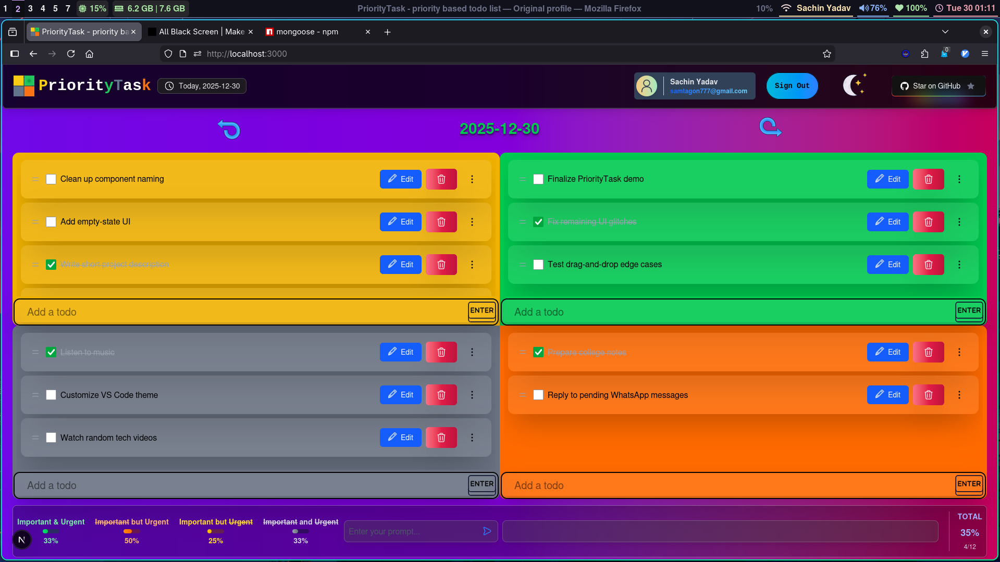
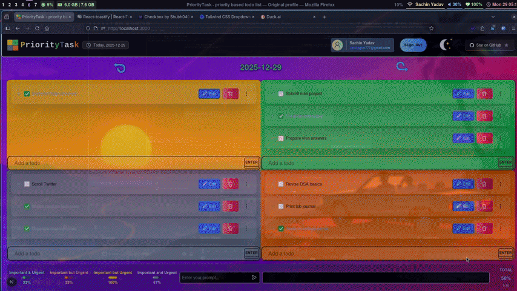
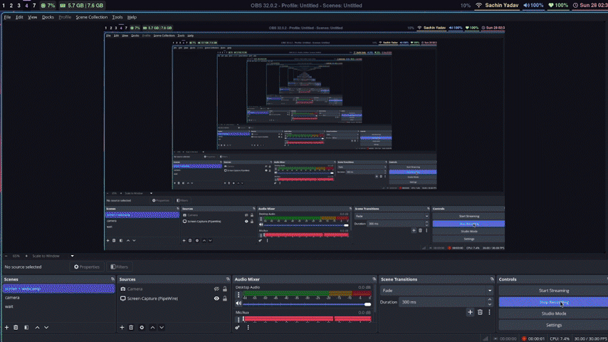
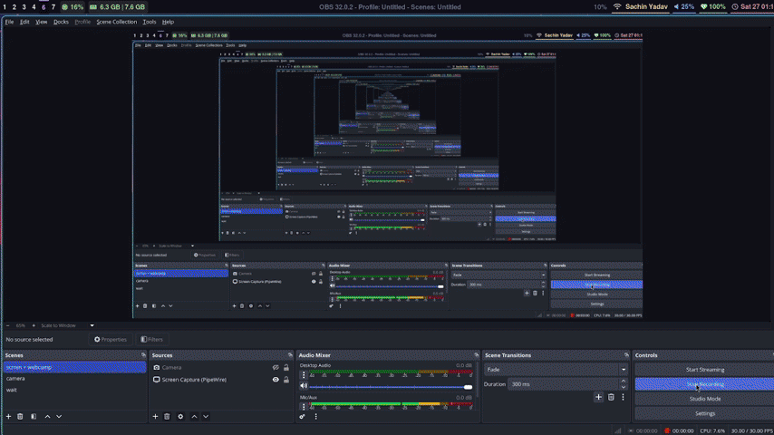
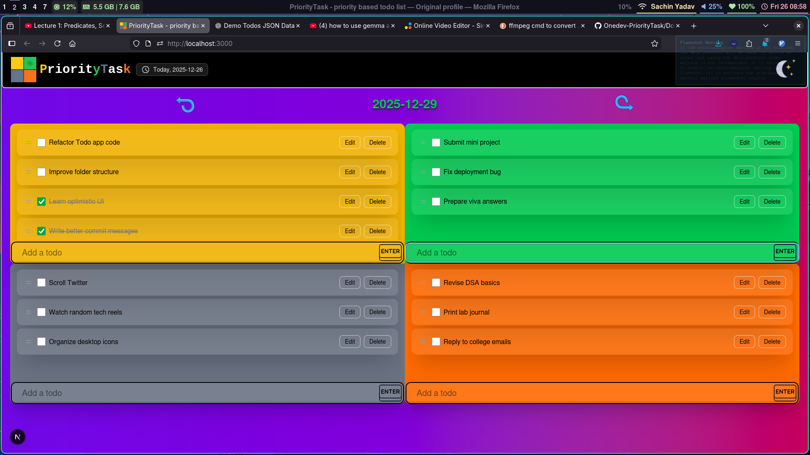
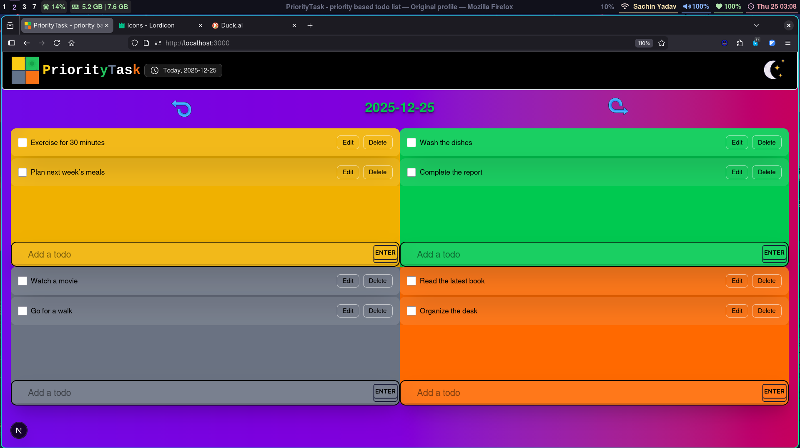
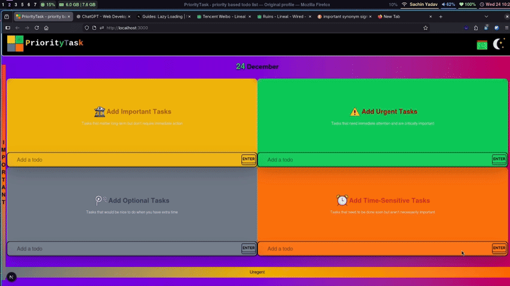
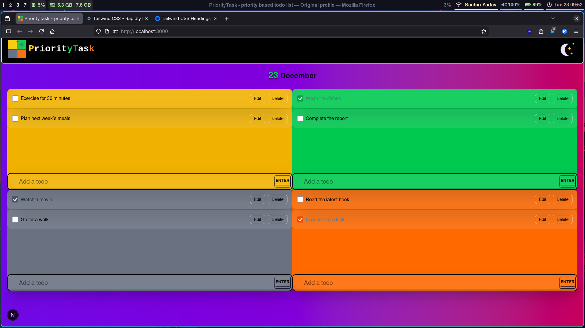
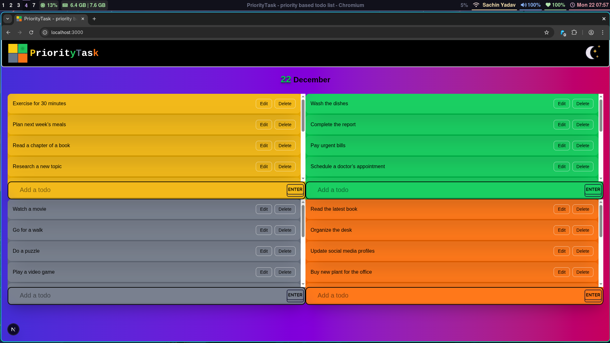
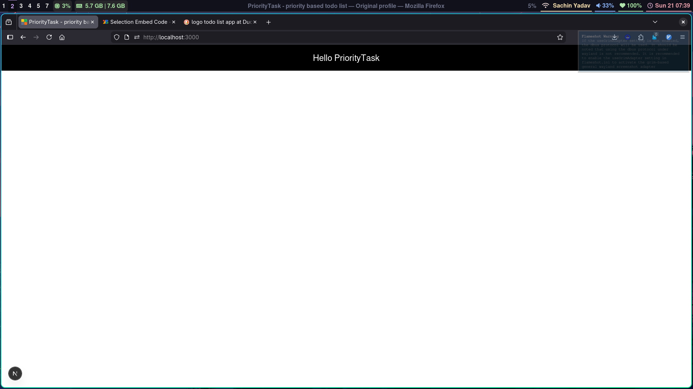

# PriorityTask

**PriorityTask** is a priority-based task management web application designed to help users focus on what matters most instead of treating all tasks equally.

This project is being built as part of **Genesis 1.0 Hackathon** and is developed as a **solo project** under the OneDev identity.

---

## 🧠 Problem Statement

Most traditional to-do applications list tasks without emphasizing priority.  
As a result, users often feel overwhelmed and struggle to decide which task should be done first.

There is a need for a simple system that:
- Highlights task importance
- Encourages intentional planning
- Reduces decision fatigue

---

##  Solution

PriorityTask introduces a **priority-first workflow** where tasks are organized based on their importance.  
Users can quickly identify high-priority tasks and focus their energy on meaningful work.

The application keeps the interface minimal and distraction-free, making it suitable for students and individual learners.

---

##  Hackathon Conclusion

PriorityTask was developed as a solo project during the Genesis 1.0 Hackathon with the goal of building a usable, real-world productivity tool within a limited time frame.

Over the course of the hackathon, I successfully designed, implemented, and deployed a functional MVP that supports priority-based task management, authentication, persistent storage, and AI-assisted planning. The project demonstrates my ability to take an idea from concept to a live product under time constraints.

Due to the short development window and solo nature of the project, a few UI edge cases and interaction inconsistencies remain. These have been identified and documented and will be addressed in future iterations.

Overall, the hackathon was a valuable learning experience that strengthened my skills in full-stack development, problem scoping, and decision-making under deadlines.

Although the project was not shortlisted among the top submissions, the hackathon experience was extremely valuable. Building PriorityTask as a solo developer helped me strengthen my problem-solving skills, improve my ability to scope features realistically, and gain confidence in shipping a complete product under tight deadlines.

---

##  Project Status

### what works : 
Checkbox and todo drag and drop
SignIn by google and github works
AI feature is connected
dropdown for each card for productive use case
MongoDB and localstorage both works
Deployed to versel
Responsive for mobile
Fixed AI undefined error

### what broken : 
AI box is explaning
when i login and comeback to / then why the arrow on todo_matrix.jsx which are for navigabtion btw date don't appear and neither ther is anything at its page then i refresh the page and see the arrow come back and now i can navigate a wired glitch

### what plan : 
Added more productive features
UI stabishing

---

## 📅 Project Timeline

### as on 2 Jan 2026

### as on 1 Jan 2026

### as on 30 Dec 2025

### as on 29 Dec 2025

### as on 28 Dec 2025

### as on 27 Dec 2025

### as on 26 Dec 2025

<!--  -->

### as on 25 Dec 2025

### as on 24 Dec 2025

### as on 23 Dec 2025

### as on 22 Dec 2025

### Started on 21 Dec 2025

---
## 🚀 Planned Features

- Create tasks with priority levels (On a co-ordinate system of urgent V/S important)
- Mark tasks as completed
- Persistent task storage
- Clean and responsive UI

---

## 🛠 Tech Stack

- **Frontend:** Next.js (App Router)
- **Styling:** Tailwind CSS

---

## Inspration artical

### [Artical on Eisenhower Matrix](https://asana.com/resources/eisenhower-matrix)

